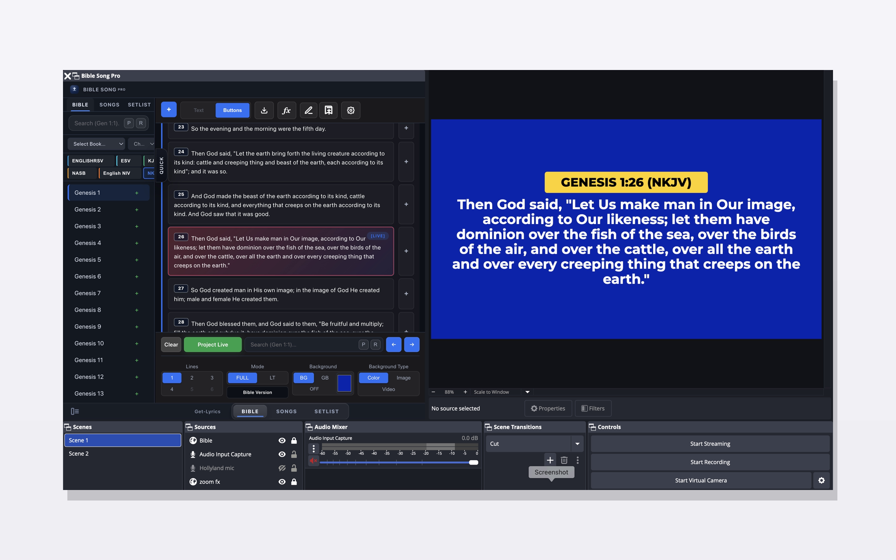
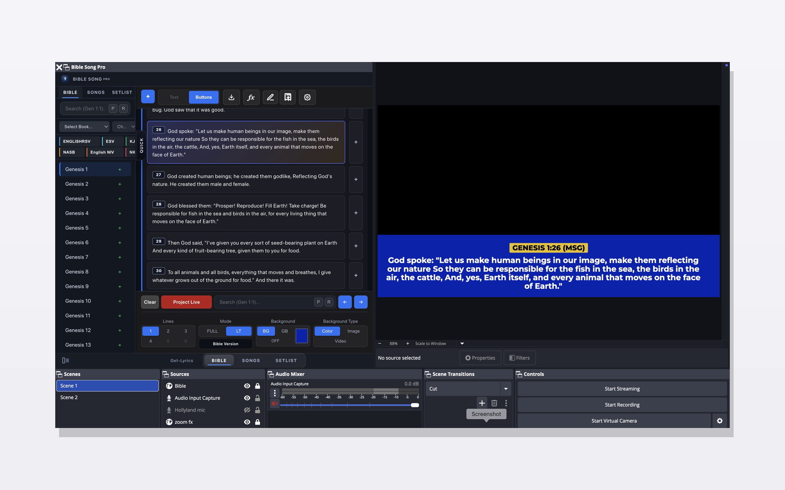
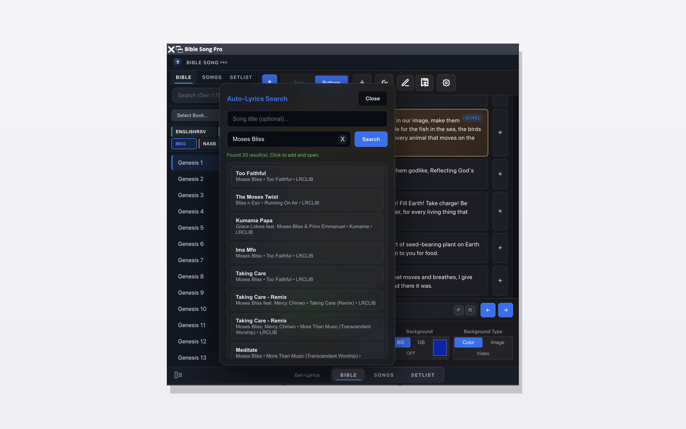
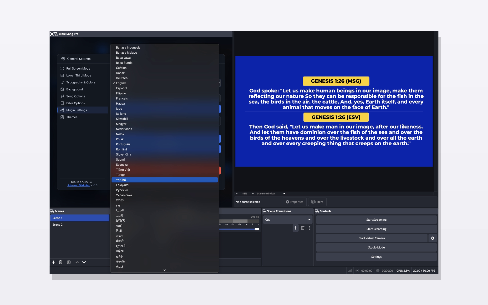
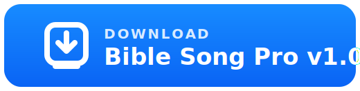

# Bible Song Pro – OBS Overlay for Bible Verses & Song Lyrics

A modern church presentation system for OBS Studio that lets you display Bible verses and song lyrics in real-time.

---

## Preview

---

## Get Started

👉 Download the latest version: [Download Here](https://github.com/Johnbatey/bible-song-pro-obs/releases/latest)

👉 Watch demo: [YouTube Demo](https://www.youtube.com/watch?v=4SVs5jyYx3o)

---

## Features

- Real-time Bible verse display
- Auto-Retrieve Lyrics
- Real-time song lyrics presentation
- Clean broadcast-style UI
- Fully customizable display
- Lightweight and fast
- Works directly inside OBS Browser Source

---

## Setup (2 Minutes)

1. Open OBS Studio
2. Add `BSP_display.html` as a Browser Source in your scene
3. Add `Bible Song Pro panel.html` as an OBS custom browser dock
4. Open the panel and start controlling your live display

---

## How It Works

- `Bible Song Pro panel.html` -> Control interface
- `BSP_display.html` -> OBS output screen
- Real-time sync via `BroadcastChannel` API

---

## Built for Churches

Bible Song Pro is designed to help churches and ministries present scripture and song lyrics beautifully during live streams without complex software.

---

## Demo

Watch it in action:  
[https://www.youtube.com/watch?v=4SVs5jyYx3o](https://www.youtube.com/watch?v=4SVs5jyYx3o)

---

## Download

Get the latest version here:  
[https://github.com/Johnbatey/bible-song-pro-obs/releases/latest](https://github.com/Johnbatey/bible-song-pro-obs/releases/latest)

---

## Tech Stack

- HTML, CSS, JavaScript
- `BroadcastChannel` API
- OBS Browser Source

---

## Support

- Instagram: `https://www.instagram.com/johnsonolakotan`
- 

---

## Feedback Backend

To let the in-app Feedback form create GitHub issues directly, run the bundled backend:

1. Set environment variables:
   - `GITHUB_TOKEN` = a GitHub token with issue write access
   - `GITHUB_REPO` = `Johnbatey/bible-song-pro-obs` (or another `owner/repo`)
   - Optional: `FEEDBACK_PORT` = backend port, default `8787`
2. Start the server:
   - `npm run feedback:server`
3. Start the app and use the Feedback tab. The public build uses the bundled default feedback endpoint automatically.

Health check:
- `http://127.0.0.1:8787/health`

The backend keeps the GitHub token on the server side and returns the created issue URL to the app.

---

## Feedback Worker

For public deployment without keeping your PC running, use the Cloudflare Worker in [feedback-worker](feedback-worker).

Quick path:

1. `cd feedback-worker`
2. `npm install`
3. `npx wrangler login`
4. `npx wrangler secret put GITHUB_TOKEN`
5. `npm run deploy`
6. If you change the deployed Worker in future, update the default feedback endpoint in the panel source.
   - Current deployed Worker: `https://bible-song-pro-feedback.johnbatey-bsp.workers.dev/api/github-feedback`

The Worker setup is documented in [feedback-worker/README.md](feedback-worker/README.md).

---

## License

GPL-3.0. See [LICENSE](LICENSE) for full terms.
